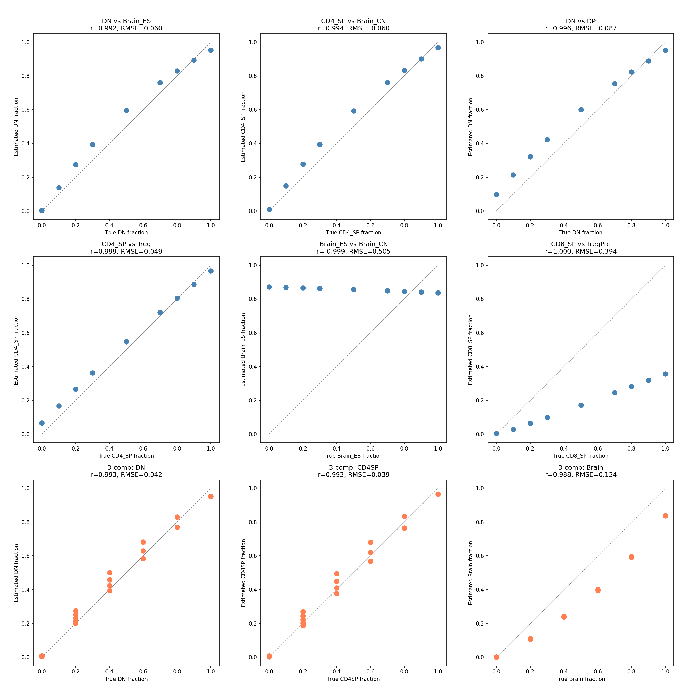
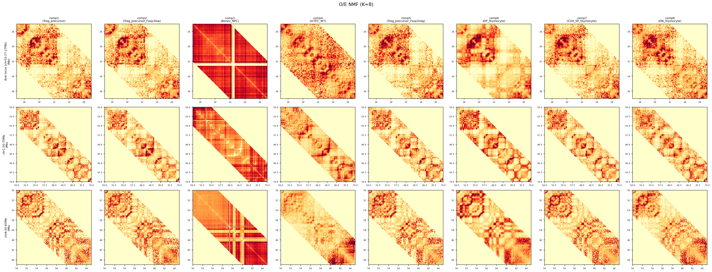
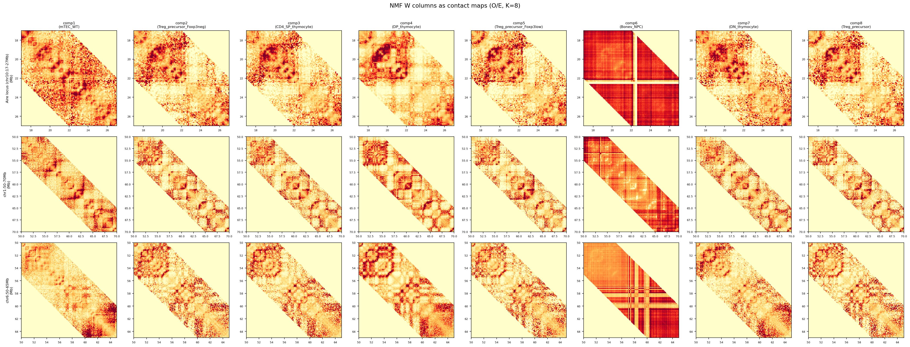
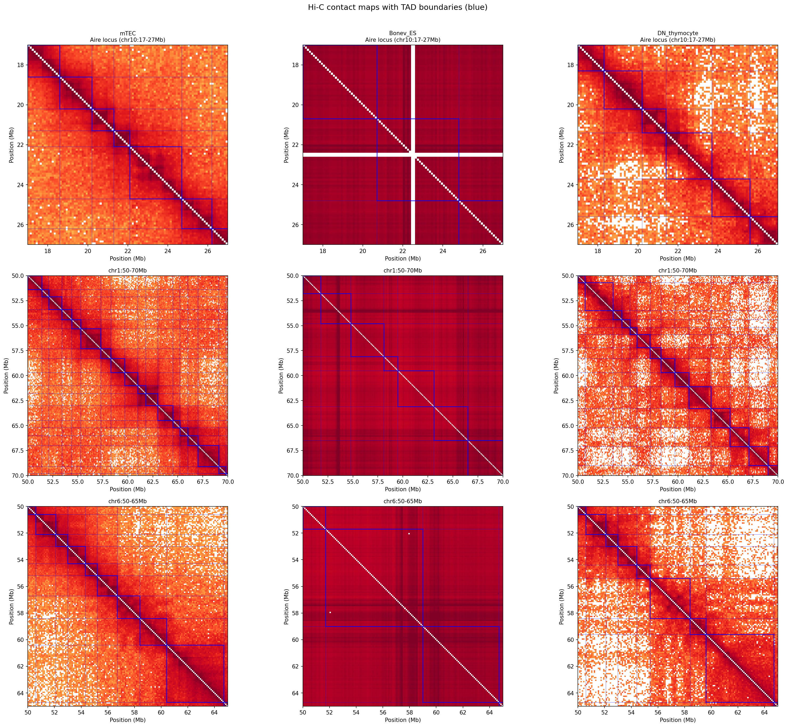

## 要旨

バルクHi-Cデータから細胞型特異的な
トポロジカルドメイン（TAD）構造を
計算論的に分離することは未解決の課題である。
非負値行列分解（NMF）はHi-Cの
deconvolutionに有効だが、
前処理としてのO/E正規化が
TAD構造を不可逆的に消失させるという
根本的なジレンマが存在する。
本研究では、Hi-Cコンタクトマトリクスを
ゲノム距離ごとのバンドに分解し、
バンド間で混合係数行列Hを共有する
**Multi-band NMF**を提案する。
この手法は距離減衰の除去と
TAD構造の保持を初めて両立させ、
マウス胸腺上皮細胞（mTEC）の
Aire遺伝子座に細胞型特異的な
コンパクトTAD（〜1Mb）を
バルクデータから直接抽出することに成功した。

## はじめに

染色体コンフォメーションキャプチャー（Hi-C）は
ゲノムの三次元構造を網羅的に捉える強力な技術であり、
TAD、コンパートメント、ループといった
階層的な構造単位の解明に貢献してきた
（Lieberman-Aiden et al., 2009;
Dixon et al., 2012; Rao et al., 2014）。
しかし、ほとんどのHi-Cデータは
細胞集団のバルク測定から得られるため、
観測されるコンタクトマトリクスは
混合組織中の複数細胞型の
シグナルの重ね合わせである。

NMFはこの混合シグナルの分離
（deconvolution）に適した手法であり、
Hi-Cデータへの適用が試みられてきた。
NMFの入力として最も一般的な前処理は
O/E（Observed/Expected）正規化であり、
これはゲノム距離に依存するコンタクト頻度の
指数関数的減衰（距離減衰）を除去する。
距離減衰はデータの分散の大部分を支配するため、
これを除去しなければNMFの基底は
距離減衰パターンのみを学習してしまう。

ところがO/E正規化には重大な副作用がある。
TADの実体は対角近傍における
局所的なコンタクトの濃縮
—— すなわち距離減衰からの
正の逸脱 —— であるため、
距離減衰の除去はTADシグナルの
大部分を同時に消失させる。
実際、本研究でO/E NMF（K=8）の
全コンポーネントからcooltools insulation scoreで
TAD境界検出を試みたところ、
**検出されたTAD境界は0個**であった（図1上段）。

このジレンマ
—— 距離減衰を除去しなければ
deconvolutionが成立せず、
除去すればTAD構造が消失する ——
は、NMFに基づくHi-C解析の
根本的な限界とみなされてきた。

本研究ではこのジレンマに対し、
距離減衰とTAD構造の情報が
異なるスケールに存在するという
洞察に基づく解決策を提案する。
距離減衰はゲノム距離バンド**間**の
スケール差として現れるのに対し、
TAD構造は各バンド**内**の
空間パターンとして存在する。
この分離可能性を利用し、
Hi-Cコンタクトマトリクスを
ゲノム距離ごとのバンドに分解した上で、
バンド間で混合係数行列Hを共有する
結合NMF（Multi-band NMF）を構築した。

## 方法

### データ

マウス（mm10）由来の複数細胞型
バルクHi-Cデータを100kb解像度で使用した。
計15サンプル、常染色体（chr1–19）のみを対象とした。

- **胸腺細胞**: 4D Nucleome Consortiumより11種
  （DN, DP, CD4 SP, CD8 SP, Treg前駆体,
  成熟Treg等の胸腺T細胞分化ステージ）
- **胸腺髄質上皮細胞（mTEC）**: GSE180937由来、
  SRA fastqからnf-core/hicで再処理した
  ICEバランス済みコンタクトマトリクス
- **脳神経細胞（対照群）**: Bonev et al. (2017)
  GSE96107より3種
  （ES細胞, 神経前駆細胞NPC, 皮質神経細胞CN）

性染色体（chrX, chrY）は
サンプル間のカバレッジ差が大きく、
ICEバランシングでも除去しきれない
十字アーティファクトをNMF基底に生じるため
除外した（性染色体除外により
mTECのloading: 0.540 → 0.870）。

### 特徴量の構築

各サンプルのICEバランス済み
コンタクトマトリクスから、
ゲノム距離5Mb以内（50 bin）の
全bin対 $(i, j)$ のコンタクト値を抽出し、
$N = 1{,}232{,}364$ 次元の
特徴ベクトルを構築した。
各特徴量にはゲノム距離
$d = j - i \in \{0, 1, \ldots, 50\}$ が付随する。

### Multi-band NMF

**バンド分解.**
特徴量をゲノム距離 $d$ ごとに
51バンドに分割する。
各バンド $d$ の特徴量行列を
$\mathbf{X}_d \in \mathbb{R}_{\geq 0}^{n_d \times M}$
（$n_d$: バンド $d$ の特徴量数、$M = 15$: サンプル数）
とする。

**モデル.**
各バンドを以下のように分解する:

$$\mathbf{X}_d \approx \mathbf{W}_d \mathbf{H}
\quad (d = 0, 1, \ldots, 50)$$

ここで
$\mathbf{W}_d \in \mathbb{R}_{\geq 0}^{n_d \times K}$
はバンドごとに独立な基底行列、
$\mathbf{H} \in \mathbb{R}_{\geq 0}^{K \times M}$
は**全バンドで共有**される混合係数行列である。
$K = 8$ とした。

この定式化の核心は、
「サンプルの細胞型組成は
ゲノム距離によらず一定である」
という生物学的に自然な仮定にある。
Hの共有により、
全51バンドのデータが協調的に
細胞型分離を制約する一方、
バンドごとに独立なW_dが
各距離スケールに固有の
空間パターン（TAD、コンパートメント等）
を自由に表現できる。

**前処理.**
各バンド内で各サンプルの合計が1となるよう
L1正規化を行った:
$$\mathbf{X}_d^{(\text{norm})}[:, m] =
\frac{\mathbf{X}_d[:, m]}
{\|\mathbf{X}_d[:, m]\|_1}$$

この正規化により
距離バンド間のスケール差
（= 距離減衰）が等化される。
一方、バンド内の空間パターン
（どのbin対のコンタクトが相対的に強いか）
は保持される。
これが距離減衰の除去と
TAD構造の保持を両立する鍵である。

**最適化.**
Multiplicative Update（MU）則に基づき
500イテレーション更新した:

$$\mathbf{W}_d \leftarrow \mathbf{W}_d \odot
\frac{\mathbf{X}_d \mathbf{H}^\top}
{\mathbf{W}_d \mathbf{H} \mathbf{H}^\top
+ \epsilon}$$

$$\mathbf{H} \leftarrow \mathbf{H} \odot
\frac{\sum_d \mathbf{W}_d^\top \mathbf{X}_d}
{\left(\sum_d \mathbf{W}_d^\top \mathbf{W}_d
\right) \mathbf{H} + \epsilon}$$

H更新式は全バンドの勾配を集約する形となり、
これが結合NMFの本質である。
$\epsilon = 10^{-10}$、乱数シード42で初期化した。

### TAD境界検出

各コンポーネント $k$ の
$\mathbf{W}_d$ を全バンドにわたって結合し、
対称コンタクトマトリクスを
染色体ごとに再構成して.cool形式に変換した後、
cooltools insulation score
（窓サイズ500kb, ignore\_diags=2）で
TAD境界を検出した。

### O/E NMFとの比較

ベースライン手法として、
O/E正規化後の全特徴量を
単一行列としてNMF分解した
（同一K=8、500イテレーション）。
O/E NMFについてはin-silico mixing検証
（fold-in法: Wを固定しHのみMU更新）
も実施し、混合比率推定精度を評価した。

## 結果

### O/E NMFは細胞型を分離するが TAD構造を消失させる

O/E NMF（K=8）は細胞型の分離に有効であった。
mTECはcomp4にloading 0.903で
明確に単独分離され、
thymocyte各分化ステージ、
brain各ステージも
それぞれ異なるコンポーネントに対応した。

in-silico mixing検証でも、
異なる系統間の2成分混合
（5ペア）で Pearson $r \geq 0.990$、
RMSE 0.042–0.134を達成した（図1）。
近縁細胞型ペアである
CD4 SP対Tregでも$r = 0.999$と
極めて正確に分離可能であった。
3成分混合（DN + CD4 SP + Brain ES）でも
$r \geq 0.976$であった。

{width=100%}

しかし、O/E NMFの全8コンポーネントから
コンタクトマトリクスを再構成し
insulation scoreを計算したところ、
**検出されたTAD境界は全コンポーネントで0個**
であった（図2）。
O/E正規化により対角近傍のコンタクト値が
平坦化された結果、
insulation scoreの計算に必要な
局所コントラストが完全に失われていた。

{width=100%}

### Multi-band NMFはTAD構造を保持したまま 細胞型を分離する

Multi-band NMF（K=8、autosome限定）の
コンタクトマップを図3に示す。
O/E NMF（図2）とは対照的に、
対角近傍にTADに対応する
明瞭な三角形パターンが
全コンポーネントにわたって保持されている。

**細胞型分離.**
mTECはcomp1にloading 0.870で分離された。
thymocyte系（DN: comp7に0.855、
CD4 SP: comp3に0.941）、
brain系（comp6に0.913）も
それぞれ明確に分離された。

{width=100%}

### TAD境界の定量的評価

comp1（mTEC基底）から
1,299個のTAD境界が検出された。
mTEC実測バルクHi-Cから検出した
リファレンス境界（1,484個）との
比較結果を表1に示す。

**表1. Multi-band NMF TAD境界の
リファレンスとの一致度**

| comp | 対応細胞型 | 境界数 | Jaccard | Recall | Prec. | Ins. $r$ |
|:----:|:----------:|:------:|:-------:|:------:|:-----:|:--------:|
| 1 | mTEC | 1,299 | **0.601** | **0.799** | **0.912** | **0.865** |
| 7 | DN | 1,179 | 0.168 | 0.507 | 0.639 | 0.577 |
| 3 | CD4 SP | 1,120 | 0.140 | 0.439 | 0.581 | 0.543 |
| 6 | Brain | 430 | 0.006 | 0.026 | 0.088 | −0.065 |

Recall/Precisionは±1 bin（100kb）の
許容幅での評価。
Ins. $r$はinsulation profileの
全染色体平均Pearson相関。

comp1はリファレンスTAD境界の
**80%を±1 bin以内で回収**し（recall = 0.799）、
検出された境界の**91%がリファレンスと一致**した
（precision = 0.912）。
insulation profileの全染色体平均相関も
0.865と高く、TAD構造が定量的に
保持されていることが確認された。

一方、thymocyte系コンポーネント
（comp3, 7）のmTECリファレンスとの
recallは44–51%と、
constitutive TAD
（細胞型間で保存される境界、約60%と推定）
の分だけ部分的に一致した。
Brain（comp6）はmTECと
全く異なるTADパターンを示し
（insulation相関 −0.065）、
Multi-band NMFが細胞型特異的な
TAD構造を分離できていることの
間接的な証拠となった。

### リファレンスHi-Cとの視覚的比較

図4にmTEC、Brain ES、DN thymocyteの
実測バルクHi-Cコンタクトマップと
TAD境界（青線）を示す。
これらはMulti-band NMFへの入力データの一部であり、
NMFが分離すべき「正解」のパターンに相当する。

{width=100%}

### Insulation profileの細胞型間比較

図5にmTEC、Brain ES、DN thymocyteの
insulation profile（log2 insulation score）を
3領域について重ねて示す。

{width=100%}

### Aire遺伝子座の細胞型特異的TAD

Multi-band NMFの生物学的妥当性を
検証するため、
胸腺髄質上皮細胞の機能に中心的な役割を果たす
**Aire遺伝子**（chr10:21.9Mb, mm10）周辺の
TAD構造を細胞型間で比較した。

Aireは胸腺髄質上皮細胞（mTEC^hi^）において
数千の組織特異抗原（TRA）遺伝子の
無差別的転写（promiscuous gene expression）
を誘導する転写因子であり、
中枢性免疫寛容の確立に不可欠である
（Anderson et al., 2002;
Mathis & Benoist, 2009）。
近年、この転写制御に
Aire座位周辺の三次元ゲノム構造が
関与することが報告されている
（Guha et al., 2017; Teixeira et al., 2021）。

**表2. Aire遺伝子座を含むTADの比較**

| ソース | TAD範囲 | サイズ |
|:------:|:-------:|:------:|
| comp1（mTEC NMF基底） | 21.2–22.3 Mb | 1.1 Mb |
| mTEC リファレンス | 21.3–22.1 Mb | 0.8 Mb |
| comp7（DN thymocyte） | 21.4–23.7 Mb | 2.3 Mb |
| comp6（Brain） | 検出なし | — |

comp1（mTEC基底）から推定された
Aire含有TADは21.2–22.3Mb（1.1Mb）であり、
mTECリファレンスの21.3–22.1Mb（0.8Mb）と
高い一致を示した。

注目すべきは細胞型間の差異である。
DN thymocyteでは
同領域のTADが21.4–23.7Mb（2.3Mb）と
mTECの約2倍広く、
Aire周辺の絶縁（insulation）が弱いことが
示唆された。
Brainではこのゲノム領域に
TAD構造がほとんど検出されなかった。

mTECにおける比較的コンパクトな
Aire含有TAD（〜1Mb）は、
Aire遺伝子の発現制御に関与する
クロマチンドメインを反映している可能性がある。
Aireはスーパーエンハンサーを介して
ゲノム上に分散するTRA遺伝子群の
転写を活性化するが（Guha et al., 2017）、
Aire自身の座位を取り囲む
コンパクトなTAD構造は、
このマスター転写因子の
発現制御における空間的な
制約条件を示唆している。
Multi-band NMFがバルクHi-Cの
混合シグナルからこのmTEC特異的な
TAD構造を分離できたことは、
本手法の生物学的妥当性を強く支持する。

## 考察

### 距離減衰とTAD構造の分離可能性

Multi-band NMFは、
Hi-Cデータに固有の距離減衰構造を
明示的にモデリングすることで、
従来のO/E NMFでは不可能であった
TAD構造の保持と細胞型分離の両立を実現した。

本手法の鍵は、
距離減衰とTAD構造が
異なる「軸」に情報を持つという
構造的洞察にある。
距離減衰はバンド間のスケール差
（d=1のバンドはd=50の数十倍の値を持つ）
として現れるが、
TAD構造はバンド内の空間パターン
（特定のbin対が同一バンド内で相対的に高い値を持つ）
として存在する。
per-band L1正規化は前者を等化し、
後者を保持する —— 
これはO/E正規化のように
個々のbin対レベルで
期待値からの逸脱を計算する操作とは
本質的に異なる。

### モデルの構造と仮定

H共有制約
「サンプルの細胞型組成はゲノム距離によらない」
は生物学的に自然な仮定である。
同一サンプルのバルクHi-Cにおいて、
近接コンタクト（d=1）と
遠距離コンタクト（d=50）の
細胞型混合比が異なるとすれば、
それは測定アーティファクトを意味する。
この仮定のもと、
51バンドのデータが協調的にHを制約するため、
少数サンプル（M=15）でも
安定した細胞型分離が可能となる。

### 性染色体アーティファクトの除去

chrX/chrYのサンプル間カバレッジ差は、
NMF基底に十字状のアーティファクトを生じさせ、
mTECのloading（0.540 → 0.870）に
大きな影響を及ぼした。
この問題はICEバランシングでは
解消されず、
常染色体への限定が有効であった。
ヒトデータへの適用では
chrXの除外のみで十分と考えられるが、
サンプルの性別構成を
事前に確認すべきである。

### 計算コストとスケーラビリティ

現在の実装はPython（numpy）の
スクラッチ実装であり、
100kb解像度・15サンプルで数分、
25kb（〜2,200万特徴量）で約47分、
10kb（〜1.2億特徴量）で約5時間と
見積もられる。
MU更新はバンドごとに独立に
実行可能であるため、
memmap + バンド逐次処理により
メモリ制約下でも10kb解像度まで
対応可能である。
大規模な結合NMF専用ライブラリや
GPUは現時点では不要であり、
手法の実装障壁は極めて低い。

### 今後の展開

本研究の結果は、
Multi-band NMFが
リファレンスパネルを必要としない
（reference-free）
Hi-C deconvolution手法として
有望であることを示す。
TADパターンそのものがコンポーネントの
生物学的解釈を与えるため、
既知の細胞型参照データに依存しない。
これはヒト臨床検体など
参照データの入手が困難な場面で
特に有用である。

今後の展開として以下が挙げられる:

1. **高解像度検証**: 25kb解像度でのTAD境界精度、
   10kb解像度でのAire座位ループレベル解析
2. **Fold-in解析**: mTECバルクHi-Cに対する
   fold-inによるmTEC亜集団
   （Aire-stage, pre-Aire, post-Aire等）の推定
3. **大規模コホート**: 数十〜数百サンプルの
   ヒト組織Hi-Cアトラスへの適用
4. **他のエピゲノムデータとの統合**:
   ChIP-seq、ATAC-seqとの結合解析による
   TAD構造の機能的解釈

## 参考文献

- Anderson MS et al. (2002) *Science* 298: 1395–1401.
- Bonev B et al. (2017) *Cell* 171: 557–572.
- Dixon JR et al. (2012) *Nature* 485: 376–380.
- Guha TK et al. (2017) *Cell Rep* 20: 604–612.
- Lee DD & Seung HS (1999) *Nature* 401: 788–791.
- Lieberman-Aiden E et al. (2009) *Science* 326: 289–293.
- Mathis D & Benoist C (2009) *Annu Rev Immunol* 27: 287–312.
- Rao SSP et al. (2014) *Cell* 159: 1665–1680.
- Teixeira V et al. (2021) *Nat Commun* 12: 6049.
